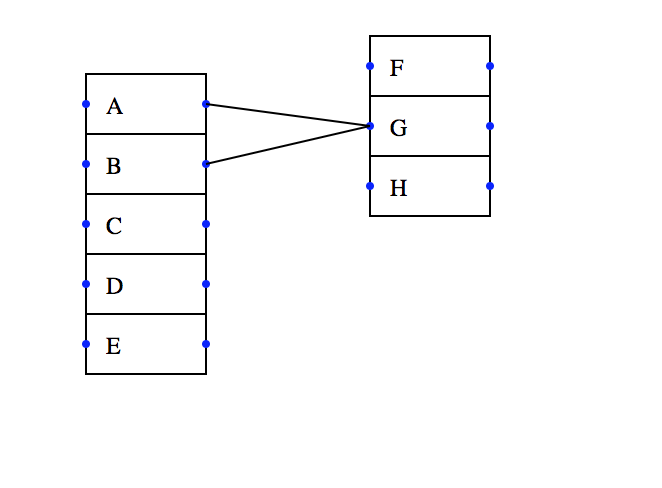

## 关系图
这个项目是使用svg实现的关系图。可以拖拽和链接模块。




### 例子

```javascript
var boxs = [
        {  widtd: 60, height: 30, text: 'A'},
        {  widtd: 60, height: 30, text: 'B'},
        { widtd: 60, height: 30, text: 'C' },
        { widtd: 60, height: 30, text: 'D' },
        { widtd: 60, height: 30, text: 'E' },

        {  widtd: 60, height: 30, text: 'F' },
        { widtd: 60, height: 30, text: 'G' },
        { widtd: 60, height: 30, text: 'H' }
        ];
      var lines = [
        { s: 0, e: 6},
        { s: 1, e: 6 }
        ];
      var groups = [
        {ele: [0,1,2,3,4], x:10, y:10},
        {ele: [5,6,7], x:200, y:10}
      ];
      var graph = new Graph({
        groups: groups,
        boxs: boxs,
        lines: lines,
        d3: d3,
        id: 'container',
        textPaddingLeft: 10,
        textPaddingTop: 8,
        textSize: 12
      });
      graph.display();
```

其中options包含如下键值：

<table>
        <tr>
            <th>选项</th>
            <th>描述</th>
        </tr>
        <tr>
            <td>boxs</td>
            <td>文字的盒子</td>
        </tr>
        <tr>
            <td>lines</td>
            <td>盒子之间对连线，s代表起始盒子的下标，e代表结束盒子的下标。</td>
        </tr>
        <tr>
            <td>groups</td>
            <td>给盒子分组，ele是盒子的下标数组， x和y代表该组在svg容器中的位置。</td>
        </tr>
        <tr>
            <td>id</td>
            <td>svg容器的id</td>
        </tr>
        <tr>
            <td>textPaddingLeft</td>
            <td>盒子左边的留白</td>
        </tr>
        <tr>
            <td>textPaddingTop</td>
            <td>盒子顶部的留白</td>
        </tr>
        <tr>
            <td>textSize</td>
            <td>文字大小</td>
        </tr>
 </table>


